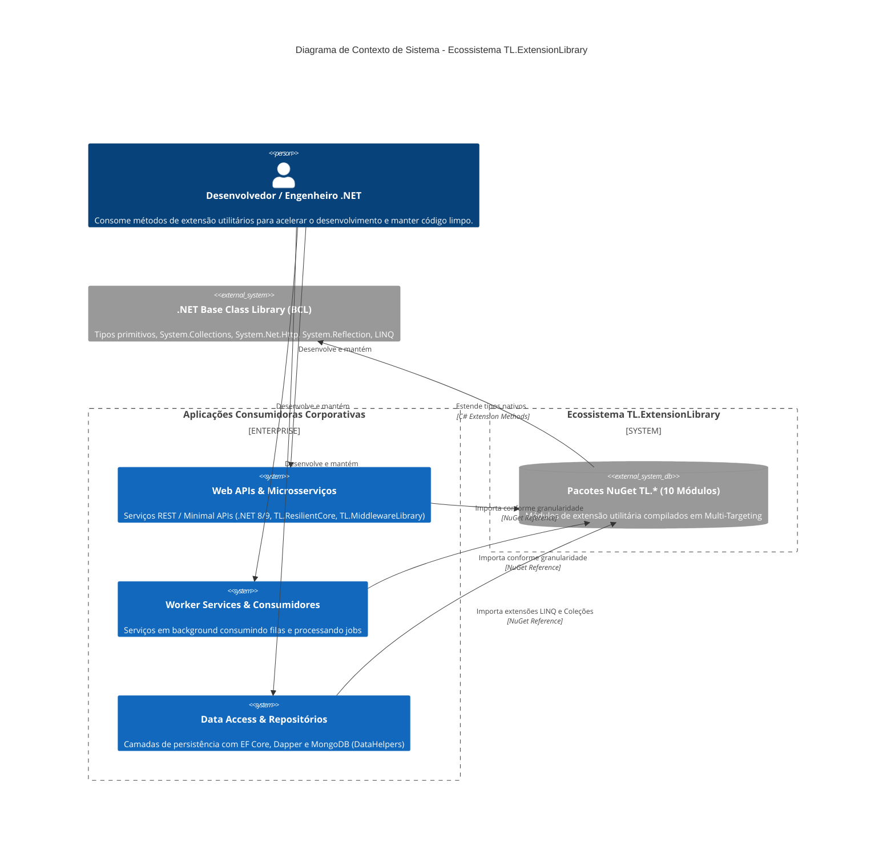

# 🏛️ Visão Geral da Arquitetura: TL.ExtensionLibrary (ExtensionLibrary)

## 📌 1. Propósito e Filosofia do Ecossistema

O **TL.ExtensionLibrary** (solução `ExtensionLibrary.sln`) é uma suíte modular de métodos de extensão em C# / .NET desenvolvida com o objetivo de estender tipos primitivos, estruturas fundamentais do runtime, coleções, requisições HTTP e operações de consulta do ecossistema .NET.

### Princípios Norteadores:
1. **Alta Granularidade & Baixo Acoplamento:** Cada biblioteca é empacotada individualmente no NuGet (`TL.*`), permitindo que aplicações consumidoras importem estritamente as extensões necessárias sem carregar dependências transitivas indesejadas.
2. **Pureza Funcional & Imutabilidade:** Métodos de extensão devem, por padrão, operar sem efeitos colaterais ocultos, priorizando imutabilidade e previsibilidade.
3. **Multi-Targeting Abrangente:** Suporte dual-target oficial (`netstandard2.0;net8.0`), viabilizando compatibilidade tanto com aplicações legadas quanto com sistemas modernos em .NET 8+.
4. **Proteção de Invariantes (Fail-Fast):** Validação imediata de argumentos de entrada no parâmetro estendido (`this T source`) via Guard Clauses para eliminar `NullReferenceException` não tratadas.

---

## 🗺️ 2. Diagramas de Arquitetura C4

### 2.1. Nível 1: Diagrama de Contexto de Sistema (C4 Context)

O diagrama abaixo ilustra como as diversas aplicações corporativas (Web APIs, Microsserviços, Workers e Camadas de Persistência) consomem os módulos granulares da suíte **TL.ExtensionLibrary**.



---

### 2.2. Nível 2: Diagrama de Containers / Módulos (C4 Container)

O diagrama a seguir detalha os **10 módulos granulares**, os **3 metapacotes da Clean Architecture** e o projeto de **Testes de Arquitetura** que compõem a solução `ExtensionLibrary.sln`, destacando suas responsabilidades e dependências.

```mermaid
C4Container
    title Diagrama de Containers / Módulos - Suíte TL.ExtensionLibrary

    Container_Boundary(c1, "Solução ExtensionLibrary.sln") {
        Container_Boundary(meta, "Metapacotes Clean Architecture (Zero Overhead)") {
            Container(mpDom, "TL.ExtensionLibrary.Domain", "NuGet Metapackage", "Agregador de domínio puro: String, Numeric, DateTime, Enum, Collection")
            Container(mpApp, "TL.ExtensionLibrary.Application", "NuGet Metapackage", "Agregador de aplicação: Object, ClaimsPrincipal + Transitivo Domain")
            Container(mpInfra, "TL.ExtensionLibrary.Infrastructure", "NuGet Metapackage", "Agregador de infraestrutura: Queryable, HttpClient, Assembly + Transitivo Application e Domain")
        }

        Container_Boundary(mods, "10 Módulos Granulares (netstandard2.0;net8.0)") {
            Container(str, "TL.StringExtensionsLibrary", "C# / netstandard2.0;net8.0", "Manipulação de strings, casing, parsing, truncamento seguro, AppSec e regex. Depende de Newtonsoft.Json.")
            Container(num, "TL.NumericExtensionsLibrary", "C# / netstandard2.0;net8.0", "Cálculos matemáticos, números primos, fatorial, percentual, GCD/LCM e conversões de ponto flutuante.")
            Container(enm, "TL.EnumExtensionsLibrary", "C# / netstandard2.0;net8.0", "Extração de descrições com Bounded Cache, conversão em dicionários e listas tipadas a partir de enums.")
            Container(clm, "TL.ClaimsPrincipalExtensionsLibrary", "C# / netstandard2.0;net8.0", "Extração tipada de Claims, Roles, User IDs e propriedades de ClaimsPrincipal.")
            Container(asm, "TL.AssemblyExtensionLibrary", "C# / netstandard2.0;net8.0", "Inspeção de assemblies, verificação de build debug, leitura de tipos e recursos embutidos.")
            Container(dt, "TL.DateTimeExtensionsLibrary", "C# / netstandard2.0;net8.0", "Operações de calendário, UTC invariance, Unix epoch, contagem de dias úteis e conversões de datas.")
            Container(col, "TL.CollectionExtensionsLibrary", "C# / netstandard2.0;net8.0", "Operações sobre IEnumerable, List, Dictionary, Queue, Stack e particionamento (ChunkBy, Shuffle, WhereIf).")
            Container(http, "TL.HttpClientExtensionsLibrary", "C# / netstandard2.0;net8.0", "Políticas de resiliência, retry, rate limit, enriquecimento de headers e tokens JWT. Depende de Newtonsoft e Jwt.")
            Container(obj, "TL.ObjectExtensionsLibrary", "C# / netstandard2.0;net8.0", "Clonagem profunda, conversão para ExpandoObject, serialização em bytes e inspeção de propriedades.")
            Container(qry, "TL.QueryableExtensionsLibrary", "C# / netstandard2.0;net8.0", "Filtros dinâmicos em IQueryable, ordenação via Expression Trees, paginação e agrupamento.")
        }

        Container_Boundary(tests, "Governança & Qualidade") {
            Container(archTests, "ExtensionLibrary.Architecture.Tests", "C# / net8.0 (NetArchTest)", "Validação automatizada de regras de acoplamento, pureza de domínio e isolamento de camadas")
        }
    }

    System_Ext(newtonsoft, "Newtonsoft.Json (v13.0.3)", "Serialização/deserialização")
    System_Ext(jwt, "System.IdentityModel.Tokens.Jwt (v8.1.2)", "Manipulação e parsing de tokens JWT")

    Rel(str, newtonsoft, "Usa para serialização")
    Rel(http, newtonsoft, "Usa para deserialização HTTP")
    Rel(http, jwt, "Usa para parsing de JWT")

    Rel(mpDom, str, "Empacota transitivamente")
    Rel(mpDom, num, "Empacota transitivamente")
    Rel(mpDom, dt, "Empacota transitivamente")
    Rel(mpDom, enm, "Empacota transitivamente")
    Rel(mpDom, col, "Empacota transitivamente")

    Rel(mpApp, mpDom, "Referencia")
    Rel(mpApp, obj, "Empacota transitivamente")
    Rel(mpApp, clm, "Empacota transitivamente")

    Rel(mpInfra, mpApp, "Referencia")
    Rel(mpInfra, qry, "Empacota transitivamente")
    Rel(mpInfra, http, "Empacota transitivamente")
    Rel(mpInfra, asm, "Empacota transitivamente")

    Rel(archTests, mods, "Audita regras arquiteturais")
```

---

## 📦 3. Catálogo de Projetos e Matriz de Multi-Targeting

### 3.1. Módulos Granulares

| Projeto / Pacote NuGet | Runtimes Alvo (`TargetFrameworks`) | Dependências Externas | Responsabilidade Principal |
| :--- | :--- | :---: | :--- |
| **`TL.StringExtensionsLibrary`** | `netstandard2.0;net8.0` | `Newtonsoft.Json` (13.0.3) | Métodos utilitários de strings, regex, checagens de formato, truncamento, AppSec e parsing. |
| **`TL.NumericExtensionsLibrary`** | `netstandard2.0;net8.0` | **Zero (BCL Pura)** | Operações matemáticas, percentuais, paridade, primalidade e trigonometria. |
| **`TL.EnumExtensionsLibrary`** | `netstandard2.0;net8.0` | **Zero (BCL Pura)** | Leitura de atributos customizados com Bounded Cache, descrições e transformações. |
| **`TL.ClaimsPrincipalExtensionsLibrary`** | `netstandard2.0;net8.0` | **Zero (BCL Pura)** | Extração simplificada e segura de Claims, Roles, IDs inteiros/longos e booleanos. |
| **`TL.AssemblyExtensionLibrary`** | `netstandard2.0;net8.0` | **Zero (BCL Pura)** | Diagnóstico de compilação (Debug/Release), enumeração de tipos e metadados de Assembly. |
| **`TL.DateTimeExtensionsLibrary`** | `netstandard2.0;net8.0` | **Zero (BCL Pura)** | Cálculos de dias úteis, idades, UTC invariance, Unix Epoch e períodos temporais. |
| **`TL.CollectionExtensionsLibrary`** | `netstandard2.0;net8.0` | **Zero (BCL Pura)** | Métodos funcionais para coleções (`DistinctBy`, `WhereIf`, `Shuffle`, `Paginate`, `ChunkBy`). |
| **`TL.HttpClientExtensionsLibrary`** | `netstandard2.0;net8.0` | `Newtonsoft.Json`<br/>`System.IdentityModel.Tokens.Jwt` | Enriquecimento de chamadas HTTP, retentativas com backoff, rate limit e extração de claims JWT. |
| **`TL.ObjectExtensionsLibrary`** | `netstandard2.0;net8.0` | **Zero (BCL Pura)** | Clonagem em memória, conversão para dicionários e `ExpandoObject`, conversão para byte arrays. |
| **`TL.QueryableExtensionsLibrary`** | `netstandard2.0;net8.0` | **Zero (BCL Pura)** | Filtros dinâmicos baseados em strings, ordenação parametrizada e paginação em `IQueryable`. |

### 3.2. Metapacotes Clean Architecture (Zero Overhead)

| Metapacote NuGet | Runtimes Alvo | Camada Alvo | Módulos Integrados |
| :--- | :--- | :--- | :--- |
| **`TL.ExtensionLibrary.Domain`** | `netstandard2.0;net8.0` | Domínio DDD / Entidades | `String`, `Numeric`, `DateTime`, `Enum`, `Collection` |
| **`TL.ExtensionLibrary.Application`** | `netstandard2.0;net8.0` | Casos de Uso / DTOs / CQRS | `Object`, `ClaimsPrincipal` + Transitivo `Domain` |
| **`TL.ExtensionLibrary.Infrastructure`** | `netstandard2.0;net8.0` | Acesso a Dados / APIs / Repositórios | `Queryable`, `HttpClient`, `Assembly` + Transitivo `Application` e `Domain` |

### 3.3. Testes de Arquitetura

| Projeto de Teste | Runtime | Biblioteca de Asserção | Objetivo |
| :--- | :---: | :---: | :--- |
| **`ExtensionLibrary.Architecture.Tests`** | `net8.0` | `NetArchTest.Rules` | Validação contínua de regras arquiteturais, impedindo acoplamento indevido entre camadas da Clean Architecture. |

---

## ⚙️ 4. Diretrizes de Engenharia e Boas Práticas

1. **Parâmetro Estendido não Nulo:** Todo método `this T source` deve validar a não-nulidade imediata de `source` (exceto métodos expressamente desenhados para testar nulidade, como `IsNullOrEmpty()`).
2. **Eliminação de Falhas Silenciosas:** Proibição estrita de blocos `catch` vazios que engolem exceções ou retornam coleções vazias ocultando erros de sintaxe ou de banco de dados.
3. **Modernização com Zero-Allocation:** Migração progressiva de operações com strings e coleções para `ReadOnlySpan<char>` e `Memory<T>`, reduzindo pressão sobre o Garbage Collector.
4. **Desacoplamento de Dependências Pesadas:** Substituição gradual do `Newtonsoft.Json` por `System.Text.Json` com Source Generators no .NET 8+.

